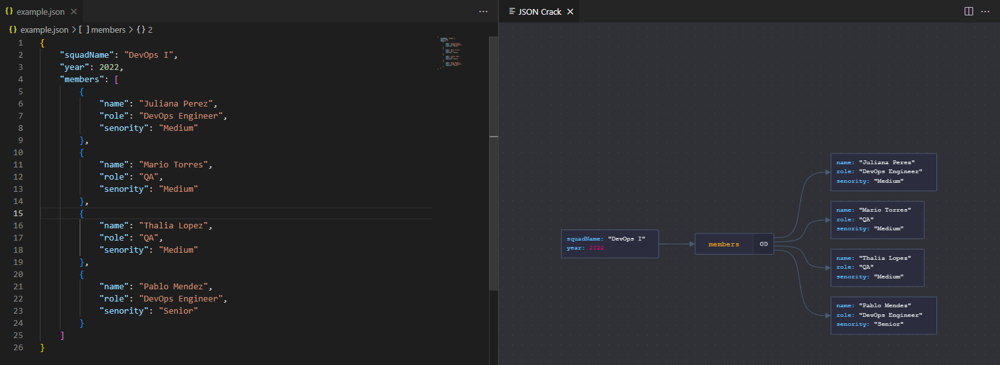

## Json Crack Extension en Visual Studio Code
Visualiza el contenido de tus archivos json de manera más simple y rápida.

1. Instala la extensión "JSON Crack"
2. Abre tu archivo json y selecciona la opción "Enable JSON Crack visualization"
<code></code>
